# @suresilly — carousel engine

**Posts to Instagram by itself. Two carousels a day, 08:00 and 20:00 IST.**

If you change something here and it is wrong, the mistake goes out. Nobody is watching at 8am.

| | |
|---|---|
| What it makes | 9-slide carousels, 1080×1350 PNG, a donkey on every slide |
| How often | 2 a day, 14 a week. No Reels, no video |
| Who approves | Nobody. Code decides. Low-scoring decks are sent to your Telegram |
| Stop it | Set repo variable `SS_HALT` to `1`, or commit a file at `state/HALT` |

---

## Run it

```bash
.agents/skills/suresilly-carousel/.venv/bin/python \
  .agents/skills/suresilly-carousel/scripts/run.py --no-post
```

| Flag | What it does |
|---|---|
| `--publish` | Build and post. What the schedule runs. |
| `--no-post` | Build and keep it. **Still uses up the idea.** |
| `--dry-run` | Look only. Writes nothing. |
| `--source feed` | Idea from a harvested post. Default. |
| `--source concept` | Idea from the proved word list. |
| `--no-fresh` | Do not draw new art. Use the pose library. |

Any run that makes a deck uses up its idea, posted or not. Only `--dry-run` does not.

---

## How a post gets made

```mermaid
flowchart TD
    A["Twice a day: 08:00 and 20:00 IST<br/>or you press Run"] --> B{"Stop switch on?"}
    B -->|yes| S1(["Stops. Nothing happens."])
    B -->|no| C{"Is our memory of<br/>past posts up to date?"}
    C -->|no| S2(["Stops. Pull the latest first."])
    C -->|yes| D{"Where does the idea<br/>come from?"}

    D -->|"the feed (normal)"| E["Search Bluesky for<br/>49 phrases we tested"]
    D -->|"the word list"| F["Pick the best psychology<br/>term we have not used"]

    E --> G["About 1,100 posts come back"]
    G --> H["Throw out anything about<br/>self-harm, abuse, crisis, minors"]
    H --> I["Keep only posts you could film.<br/>Rank by how much tension is in them"]
    I --> J{"Used this post<br/>before?"}
    J -->|yes| I
    J -->|no| K

    F --> K["ALL WE KEEP:<br/>1 topic from a list of 8,<br/>+ one short phrase.<br/>The post itself is thrown away."]

    K --> L["Tell the model what NOT to repeat:<br/>verbs and rooms used lately,<br/>a different time of day,<br/>one of 5 example sentences"]
    L --> M["The model writes<br/>our own small moment"]

    M --> N{"Is it a repeat?<br/>same words · same opening verb<br/>· same room · copied our example"}
    N -->|yes, up to 4 tries| L
    N -->|"still repeating"| S3(["Stops. Try again tonight."])
    N -->|no| O{"Is it safe to post<br/>about at all?"}
    O -->|no| I
    O -->|yes| P["Plan the 9 slides.<br/>4 tries"]
    P -->|"all 4 fail"| S4(["Stops. No post today."])
    P --> Q["Write the 9 slides.<br/>7 tries"]

    Q --> R{"A second company's model<br/>argues against posting it"}
    R -->|"it objects"| S5(["Stops. Never posted."])
    R -->|"it cannot"| T["Check: not like past posts,<br/>slides hold together,<br/>the book quoted is real"]
    T -->|"any check fails"| S6(["Stops."])
    T -->|"all pass"| U["Draw a donkey for each slide<br/>from that slide's own words.<br/>If drawing fails, use the<br/>pose library instead"]

    U --> V["Make the 9 images"]
    V --> W{"Score out of 100"}
    W -->|"below the bar"| X["HELD. Sent to your Telegram<br/>with the score and a preview"]
    X --> Y{"You reply"}
    Y -->|"publish"| Z
    Y -->|"rerun"| S7(["Thrown away. Tonight builds another."])
    W -->|"above the bar"| Z["Put the images on our website"]

    Z --> AA["Wait until they load publicly"]
    AA --> AB["Post to Instagram"]
    AB --> AC["Delete website images<br/>older than 14 days"]
    AB --> AD["3 days later: record how many<br/>people saw, saved and shared it"]
    AD --> AE["Written down for you to read.<br/>It never changes what gets posted."]
```



---

## Why ideas can repeat

1,100 posts come in. **All we keep from one is a topic (1 of 8) and a short phrase.** The post is thrown away — that is what stops us republishing a stranger's evening.

So the model writes from a category, with no memory of last week. It reaches for the same sentence.

Four checks stop that. All in code, all measured on real output:

| Check | Catches | Looks back |
|---|---|---|
| Same words | A reworded copy | everything |
| Same opening verb | Same sentence, new nouns | last 8 |
| Same room | 5 kitchens out of 12 | last 3 |
| Copied our example | The prompt's own sample sentence | that run's example |

Code also pushes: before writing, it names the verbs and rooms used lately and forbids them, rotates the time of day, and raises the model's temperature.

**It will repeat less. It is not proof against a new pattern nobody has seen yet.** If a moment looks familiar, say so and it becomes check five.

---

## Keys

| Secret | For | Without it |
|---|---|---|
| `BLUESKY_HANDLE`, `BLUESKY_APP_PASSWORD` | reading the feed | run stops |
| `GEMINI_API_KEY` | writing | falls to the next vendor |
| `GROQ_API_KEY` | second vendor | critic may not be independent |
| `CLOUDFLARE_ACCOUNT_ID`, `CLOUDFLARE_API_TOKEN` | third vendor, and drawing | as above |
| `IG_USER_ID`, `IG_ACCESS_TOKEN` | posting | builds, cannot post |
| `TELEGRAM_BOT_TOKEN`, `TELEGRAM_CHAT_ID` | held decks reaching you | you find out by looking |

**Two vendors minimum.** A model rates its own writing too highly, so the critic must not be the one that wrote it.

Everything runs on free allowances. Check what is left:

```bash
.agents/skills/suresilly-carousel/.venv/bin/python scripts/capacity.py
```

---

## When a deck is held

Scored out of 100. Above the bar it posts itself. Below, it is finished and waits for you in Telegram with the score and a preview.

```
publish 79262b     post it
rerun 79262b       bin it, tonight builds another
list               what is waiting
```

**Harm never reaches you.** Dangerous advice, a made-up statistic, a real person named — those stop the deck outright. There is no approve button for them.

---

## Run the tests

```bash
for t in .agents/skills/suresilly-carousel/tests/test_*.py; do
  if grep -q '^import pytest' "$t"; then
    .agents/skills/suresilly-carousel/.venv/bin/python -m pytest "$t" -q || echo "FAILED $t"
  else
    .agents/skills/suresilly-carousel/.venv/bin/python "$t" || echo "FAILED $t"
  fi
done
```

**Two styles live here and each is silent when run wrong.** Four suites are pytest-style with no `__main__`; run them as scripts and they execute nothing and exit 0. The rest are plain scripts; collect them with pytest and it finds no tests and passes. Both look like success. The loop above asks each file which it is.

No suite may write to `state/`. CI fails the build if one does.

---

## Layout

```
.agents/skills/suresilly-carousel/   the engine
├── SKILL.md              entry point
├── references/           voice · playbook · design system · citations
├── mascot/               poses and the character bible
├── scripts/              run.py is the only entry point
└── tests/                25 suites

scripts/                  the jobs around it — NOT the engine's scripts/
                          post_to_ig · prune_slides · insights · notify
                          · capacity · dashboard
carousels/<date>_<slug>/  carousel.md + contact_sheet.png
state/                    what has been used. Committed.
research/                 ⚠ 02_account_database and 05_hooks_database
                          contain invented numbers. Do not build on them.
```

---

## Where slides live

Instagram fetches each image **once**, when the post is assembled. The URL only has to answer for about a minute.

| | Job | Kept |
|---|---|---|
| `media.suresilly.com` | what Instagram reads | 14 days |
| the repo | the archive you look at | forever |

The repo keeps `carousel.md` and `contact_sheet.png`. Full-size PNGs and per-deck mascot folders are gitignored — they would add ~15 MB a day to git history forever.

**Held decks are the exception.** They post days later from that same host, so their slides are protected by name until you answer.

---

## What happened after a post

`scripts/insights.py` records reach, saves, shares and interactions three days after posting, into `state/insights.jsonl`.

**It reads. It never decides.** Nothing in the pipeline may import it. A number that starts choosing hooks is how "code decides" stops being true.

---

## The rules

`AGENTS.md`. Each one exists because it already broke once.
